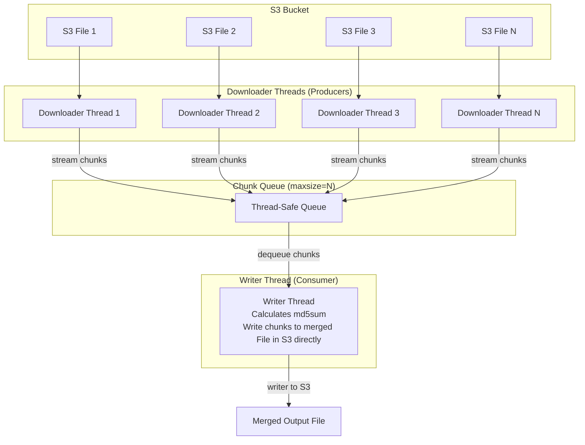

# Part File Merger using PyArrow Design

```mermaid
flowchart TD
    subgraph S3 Bucket
        S3File1[S3 File 1]
        S3File2[S3 File 2]
        S3File3[S3 File 3]
        S3FileN[S3 File N]
    end

    subgraph "Downloader Threads (Producers)"
        DownloadThread1[Downloader Thread 1]
        DownloadThread2[Downloader Thread 2]
        DownloadThread3[Downloader Thread 3]
        DownloadThreadM[Downloader Thread N]
    end

    subgraph "Chunk Queue (maxsize=N)"
        Queue[Thread-Safe Queue]
    end

    subgraph "Writer Thread (Consumer)"
        Writer[Writer Thread<br>Calculates md5sum<br>Write chunks to merged File in S3 directly]
    end

    S3File1 --> DownloadThread1
    S3File2 --> DownloadThread2
    S3File3 --> DownloadThread3
    S3FileN --> DownloadThreadM

    DownloadThread1 -- stream chunks --> Queue
    DownloadThread2 -- stream chunks --> Queue
    DownloadThread3 -- stream chunks --> Queue
    DownloadThreadM -- stream chunks --> Queue

    Queue -- dequeue chunks --> Writer
    Writer -- writer to S3 --> LocalFile[Merged Output File]
```
