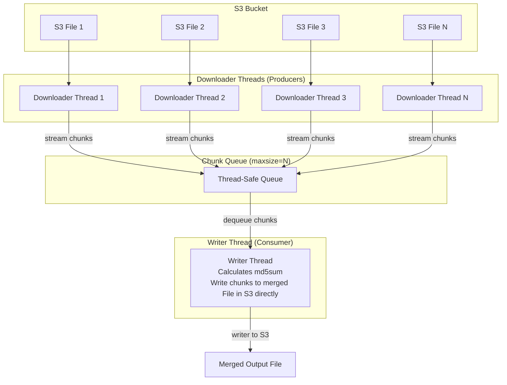

# Part File Merger using PyArrow Design
This approach is a simple implementation of Publisher-Consumer architecture using PyArrow to achieve the required performance.

This implementation combines, multi-threaded, raw-bytes chunked streaming, and a thread safe bounded queue to act as a bugger between the streaming/reading threads (further referred as downloading threads), and the single writing thread. Idea is to keep the process performant and memory-safe.

Architecture works as follows:
1. **Producer Threads**: A pool of worked threads that will read the assigned files in chunks of raw-bytes from S3.
2. **Bounded Queue**: The producers put these downloaded chunks into a thread-safe queue that has a maximum size (e.g., it can only hold a certain number of chunks at a time). This is the key to controlling memory usage. If queue is full, the producer theread will automatically pause until there is space.
3. **Consumer Thread**: A single, separate thread continuously taking chinks out of the queue and writes them to a file in S3 in compressed format (`.gzip`). Implementation is generalized to support both compressed and uncompressed writes.

This architecture ensires that only a small number of chunks are in memory at any given time (in queue), giving high throughput from parallel downloads without the risk of running out of memory.

## Benefits of thie Architecutre:
- **Maximum Parallelism**: We get the full benefit of multi-threaded downloads from S3, which is critical for overcoming network latency, as reads are happening directly from S3.
- **No local disk requirement**: Previously perfomring the merge, we had to copy the part files in EMR Master node disk for merging via Unix shell scripting. This required the 2x disk space at a given point of time when a feed file needs to be merged. For e.g., if a 93GB feed needs to be merged:
    - 93GB space required for holding the part files
    - 93GB space required for holding the merged file getting generated during the merge operation.
- **Scalability**: This pattern scales amazingly as this can merge huge amount of data with a very small and constant memory footprint.
- **Controller Memory Usage**: Thread-safe bounded queue is the critical component. It guarantees that the total memort used by buffered chunks will not exceed `max_chunks_in_queue * chunk_size_bytes`. This also keeps the memory usage predictable and low.
- **MD5 sum calculation**: MD5 sum is calculated during the same time this merge process is happening, which reduces the requirements of re-reading the file.

